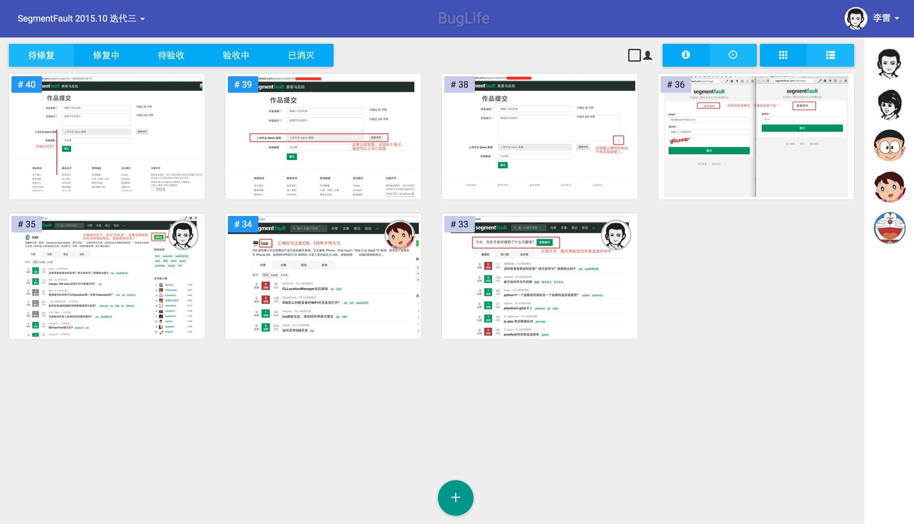
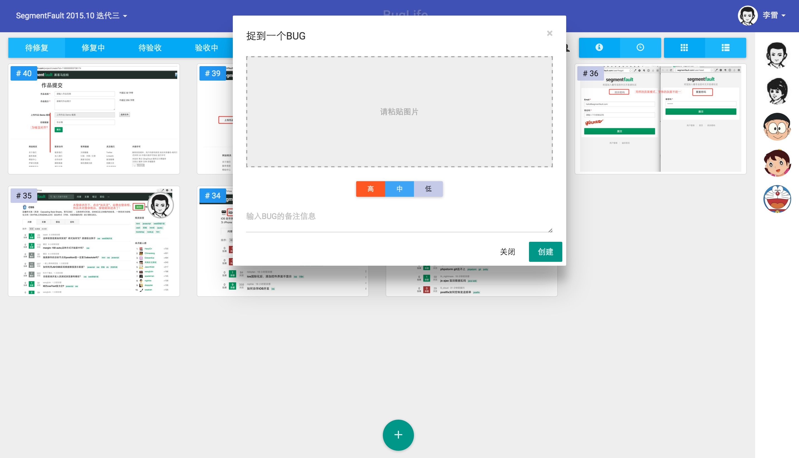
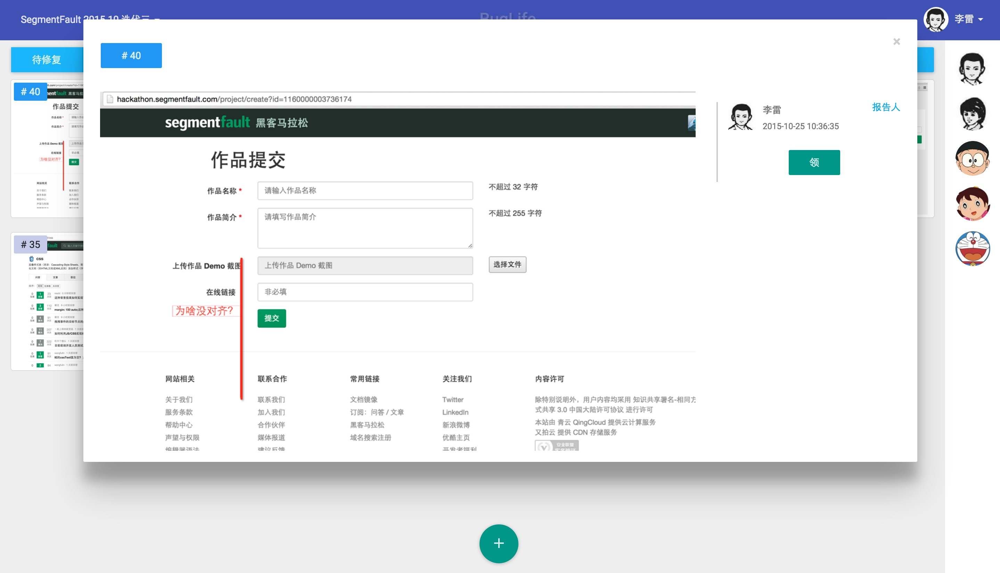

# BugLife

可视化Bug追踪系统的领导者。

## 简介

BugLife是一款可视化Bug追踪系统，以截图来描述BUG。通过ctrl+c/ctrl+v就能快速的完成一个BUG的添加；通过简单的鼠标、快捷键的操作，就能完成Bug的认领、修复、验收等状态变更操作。
自从有了BugLife，提高了干活的效率，从此程序员们，有了异性交友的时间，生活幸福指数啪啪啪的往上涨。。。

## 系统版本

v0.0.1，目前系统只能达到Demo的程度，尚在不断的迭代中，如需了解系统状态，请提issue。


## 运行截图





## 系统配置

```
server {
    listen 80;
    server_name bugworld.dev;
    root /var/www/bugworld/web;

    access_log /var/log/nginx/bugworld.access.log;
    error_log /var/log/nginx/bugworld.error.log;

    location / {
        index index.php;
        try_files $uri @rewriteapp;
    }

    location @rewriteapp {
        rewrite ^(.*)$ /index.php/$1 last;
    }

    location ~ ^/(index|index_dev)\.php(/|$) {
        fastcgi_pass   127.0.0.1:9000;
        fastcgi_split_path_info ^(.+\.php)(/.*)$;
        include fastcgi_params;
        fastcgi_param  SCRIPT_FILENAME    $document_root$fastcgi_script_name;
        fastcgi_buffer_size 128k;
        fastcgi_buffers 8 128k;
    }

    location ~* \.(jpg|jpeg|gif|png|ico|swf)$ {
        expires 3y;
        access_log off;
        gzip off;
    }

    location ~* \.(css|js)$ {
        access_log off;
        expires 3y;
    }
}
```